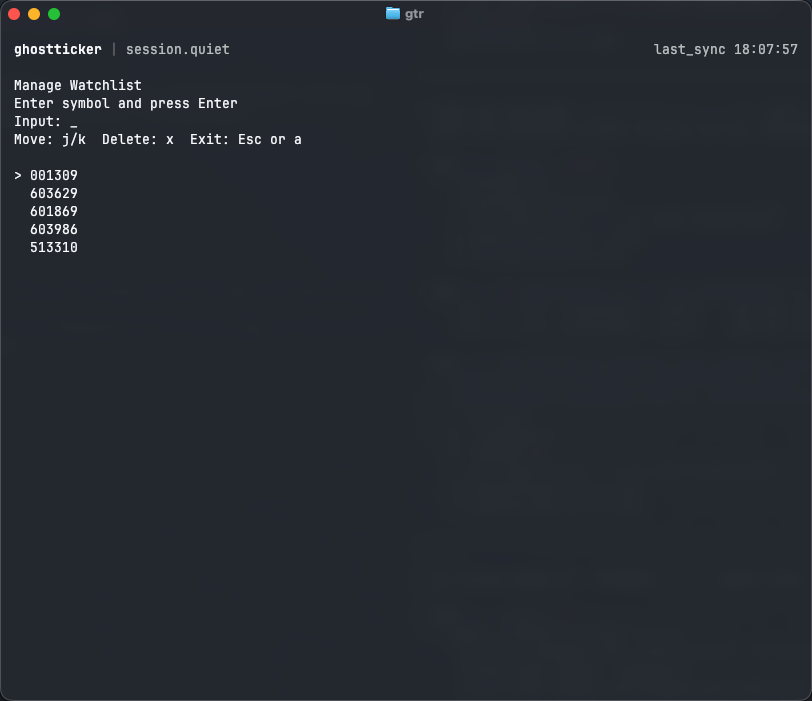
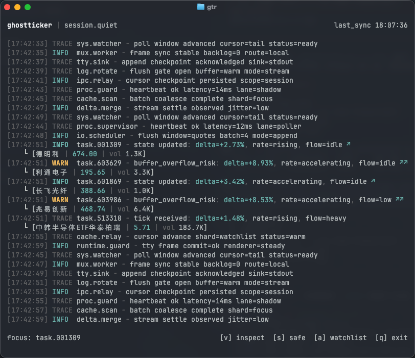
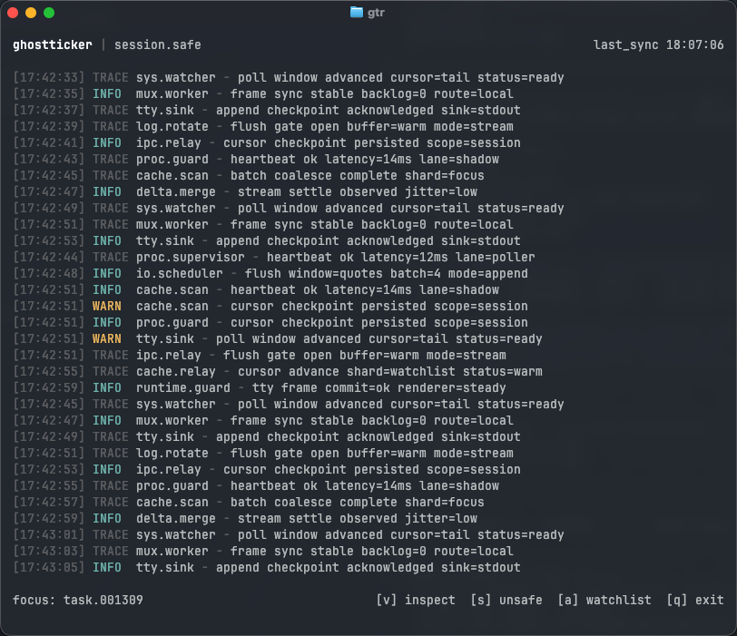
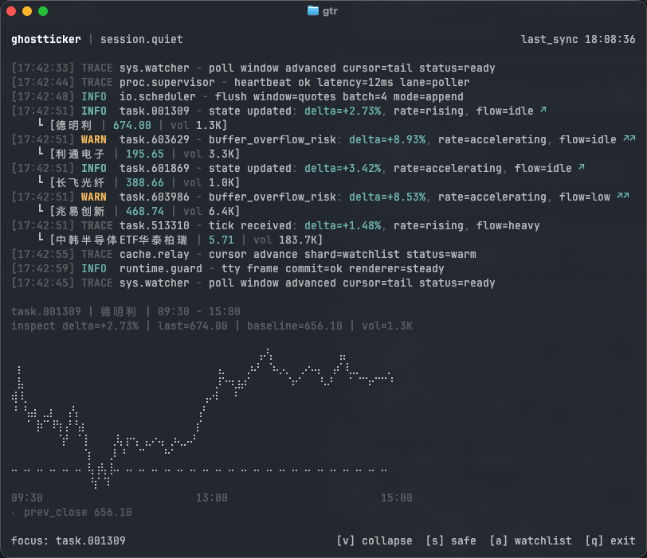

# ghostticker

<p align="center">一个伪装成开发者终端日志窗口的 A 股自选观察 CLI。</p>

<p align="center">
  本地运行、键盘操作、日志伪装优先、按需展开分时图。
</p>

## 项目介绍

`ghostticker` 是一个面向个人场景的终端 TUI，用来在工作环境中低调查看 A 股自选标的的盘中变化。

它不是完整的交易终端，也不追求专业行情软件的重型能力。它关注的是另外一件事：

- 默认看起来像正常终端日志
- 关键事件能快速暴露出来
- 需要确认走势时，再按需展开详细分时
- 退出后不在屏幕上留下明显痕迹

当前唯一启动命令为：

```bash
gtr
```

## 核心优势

- 伪装优先：默认界面是单栏日志流，不做明显的大面板证券 UI。
- 本地优先：自选列表和偏好设置直接保存在本地，不依赖账号体系。
- 键盘优先：全流程可通过键盘完成，启动快，退出快。
- 按需看图：默认只看变化，需要时按 `v` 展开分时图。
- 低存在感：支持 `safe` 模式，在有人靠近时快速切换为更克制的纯日志形态。

## 当前功能

- 本地自选列表持久化
- 自选管理视图
- 腾讯行情接口接入
- `TRACE / INFO / WARN` 三层事件流
- 日志字段伪装
- 5 秒自动刷新
- 详细分时图
- 昨收基线参考
- 安全模式
- Alternate Screen 终端体验

## 快速开始

### 运行环境

- Node.js `22+`
- npm

### macOS / Linux 一键安装

```bash
curl -fsSL https://raw.githubusercontent.com/ggfickle/ghostticker/main/scripts/install.sh | bash
```

安装完成后，启动命令为：

```bash
gtr
```

如果 `gtr` 未生效，请把下面这行加入 shell 配置：

```bash
export PATH="$HOME/.local/bin:$PATH"
```

### Windows PowerShell 安装

在 PowerShell 中运行：

```powershell
irm https://raw.githubusercontent.com/ggfickle/ghostticker/main/scripts/install.ps1 | iex
```

安装脚本会把程序安装到 `%LOCALAPPDATA%\ghostticker`，并在 `%USERPROFILE%\.ghostticker\bin` 生成 `gtr.cmd`。

安装脚本会自动把下面这个目录加入当前用户的 `Path`，安装完成后通常可以直接运行 `gtr`。如果当前 PowerShell 仍提示找不到命令，请重新打开 PowerShell：

```powershell
%USERPROFILE%\.ghostticker\bin
```

### 从源码运行

```bash
git clone https://github.com/ggfickle/ghostticker.git
cd ghostticker
npm ci
npm run build
npm link
gtr
```

## 界面展示

以下四种界面说明基于当前版本，内容参考你提供的截图。

### 1. 自选管理视图

- 进入方式：按 `a`
- 用途：新增、查看、删除自选代码
- 特点：界面保持终端工具气质，不做明显表单式流程



### 2. 默认日志视图

- 默认状态下，以伪装日志铺满可见终端区域
- 股票事件被混入系统风格日志中间
- 适合快速扫一眼哪些标的出现变化



### 3. Safe 模式视图

- 进入方式：按 `s`
- 用途：在需要更低调时，把中间的股票信息和分时图收起
- 特点：界面保持为纯日志形态，股票事件会被替换成和上下文一致的系统日志内容



### 4. 分时展开视图

- 展开方式：按 `v`
- 展示内容：当前焦点标的的详细分时图、昨收基线、时间范围、成交量摘要
- 目标：在不完全破坏伪装感的前提下，保留足够的走势可读性



## 使用说明

### 常用按键

- `a`：打开或关闭自选管理
- `j / k`：切换焦点标的
- `x`：删除当前选中标的
- `Enter`：在管理视图中保存输入的股票代码
- `v`：展开或收起当前焦点标的的分时图
- `s`：切换安全模式
- `q`：退出
- `Esc`：退出当前态或直接退出程序

### 推荐使用方式

- 平时保持默认日志视图
- 发现 `WARN` 或明显状态切换时再展开分时图
- 需要更低调时切到 `safe` 模式
- 用 `a` 维护自选，不需要每次重输标的

## 显示模式

### Quiet 模式

- 默认模式
- 显示伪装日志和事件流
- 保留关键信息字段：`task / delta / rate / flow`
- 可展开详细分时图

### Safe 模式

- 更克制的显示形态
- 用于有人靠近时快速降噪
- 按 `s` 切换后会收起分时图，并把可见股票事件伪装成普通系统日志
- 不显示股票名称、价格、涨跌幅等明显行情特征

## 本地数据

程序会在本地保存自选和偏好配置：

```text
~/.ghostticker/
```

默认包含：

- `watchlist.json`
- `preferences.json`

## 技术栈

- TypeScript
- Node.js
- React
- Ink
- Tencent Finance API

## 开发与测试

### 本地开发

```bash
npm run build
npm test
```

### 打包

```bash
npm pack
```

## 项目定位

这个项目的定位不是“终端版同花顺”或“命令行交易软件”，而是：

> 把盘中观察行为伪装成正常终端日志会话。

如果你要的是完整交易能力、盘口、逐笔、技术指标大面板，这个项目不是那个方向。

## 免责声明

- 本项目仅用于个人学习、终端 UI 实验和公开行情观察。
- 不构成任何投资建议。
- 请自行评估数据源延迟、可用性和准确性。

## License

MIT
