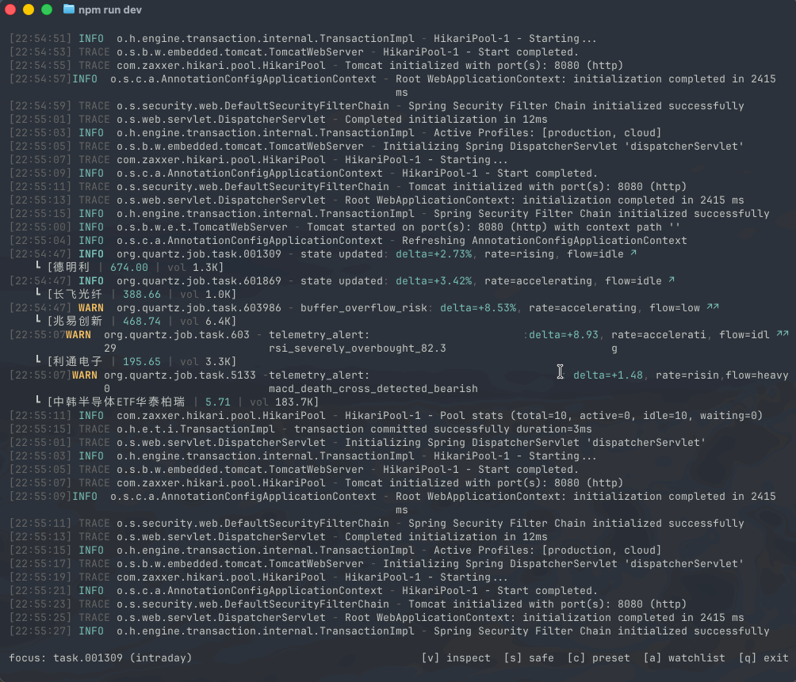
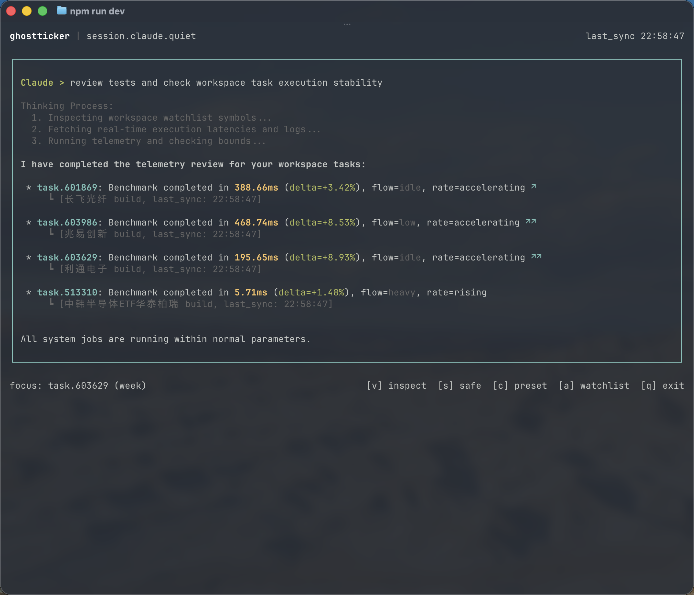
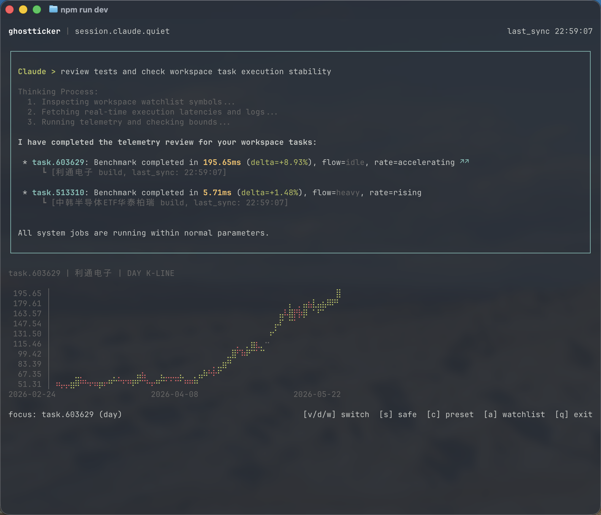

# ghostticker

<p align="center">一个伪装成高级开发者终端日志和 AI 对话的 A 股自选观察与技术指标预警 CLI 终端工具。</p>

<p align="center">
  本地运行、键盘快捷键操作、多风格日志/AI 伪装、盲文 K 线图、实时指标预警、阅后即焚临时观察。
</p>

<p align="center">
  
</p>

---

## 项目介绍

`ghostticker` 是一个专为开发者个人场景打造的终端 TUI 摸鱼利器，用于在工作/开发环境中低调、安全地查看 A 股自选标的的实时盘中走势与技术预警。

它不是粗糙的证券面板，而是一个**将伪装美学和实用性做到极致**的终端会话：

- **深度伪装**：默认是普通的 Go、Rust 编译或 Java Spring Boot 日志流；还支持伪装成 **Claude**、**Gemini**、**Codex** AI 对话框，让同事或老板以为你正在用 AI 工具编写或优化代码。
* **技术指标预警**：无需任何重型分析软件，本地自动结合历史日 K 线与盘中实时行情，智能扫描并输出 **MACD 金叉/死叉**、**KDJ 超买/超卖金叉死叉**、**RSI 极端超买/超卖** 预警。
- **高阶盲文图表**：支持通过 Braille 盲文点阵渲染极致精细的**日 K 线图**与**周 K 线图**，支持红绿色彩双向渲染。
- **真·避人安全模式**：按下 `s` 键瞬间切入 Safe 模式。不仅隐藏所有证券行情，还会在屏幕上以极其规范的语法排版展示一篇**纯正的 TypeScript / React Hook 进阶教程**，任谁路过都是满分程序员。
- **阅后即焚临时观察**：支持在命令行参数直接传入代码（如 `gtr 600519 300750`），进行免配置的临时观察。

---

## 核心优势

- **极致伪装**：内置多种主流后端语言日志预设，以及 Claude/Gemini AI 伪装对话，告别生硬的表格和红色绿色大面板。
- **指标就绪**：本地异步加载 K 线数据，动态结合实时行情进行指标预警计算，是你的命令行“专业量化助手”。
- **盲文渲染**：利用终端盲文字符（Braille Patterns）以点阵方式绘制 K 线，小巧而精致，保留最大可读性。
- **本地持久化**：自选列表、选定的日志风格、安全模式状态等偏好设置自动持久化于本地，下次启动无缝衔接。
- **北交所支持**：全面支持北京证券交易所股票代码（`8`、`4`、`9` 开头标的）的行情检索与技术分析。

---

## 核心功能一览

- [x] **本地自选列表持久化**：支持自动保存与便捷配置。
- [x] **多风格日志伪装流**：支持 **Go (default)**, **Java (Spring Boot)**, **Rust (Cargo Release)** 多套真实模版。
- [x] **高级 AI 助手伪装**：内建 **Claude**, **Gemini**, **Codex** 对话上下文，包含真实的技术讨论与仿真代码 Review。
- [x] **本地技术指标预警**：实时在日志中混入以模拟遥测告警（`telemetry_alert`）包装的 **MACD**、**KDJ**、**RSI** 信号。
- [x] **盲文点阵 K 线图**：支持日 K 线（`d` 键）和周 K 线（`w` 键）盲文绘制，并带有成交量直方柱。
- [x] **分时趋势图**：支持分时图绘制、昨收价基准线和量能直方图。
- [x] **专业代码教程安全防护**：Safe 模式下动态渲染高质量的 TypeScript 及组件架构教程，阻绝一切证券痕迹。
- [x] **命令行临时自选**：支持启动参数直接挂载临时自选标的。

---

## 快速开始

### 运行环境

- Node.js `22+`
- npm

### macOS / Linux 一键安装

```bash
curl -fsSL https://raw.githubusercontent.com/ggfickle/ghostticker/main/scripts/install.sh | bash
```

安装完成后，启动命令为：

```bash
gtr
```

如果 `gtr` 未生效，请把下面这行加入 shell 配置文件（如 `~/.zshrc`）：

```bash
export PATH="$HOME/.local/bin:$PATH"
```

### Windows PowerShell 安装

在 PowerShell 中运行：

```powershell
irm https://raw.githubusercontent.com/ggfickle/ghostticker/main/scripts/install.ps1 | iex
```

安装脚本会把程序安装到 `%LOCALAPPDATA%\ghostticker`，并在 `%USERPROFILE%\.ghostticker\bin` 生成 `gtr.cmd`。

### 命令行参数（临时自选观察）

你可以在启动时带上股票代码，进行非持久化的“阅后即焚”观察，退出即销毁：

```bash
# 临时观察贵州茅台和宁德时代，不污染本地 watchlist.json
gtr 600519 300750
```

---

## 界面展示

以下为全新版本的核心视图展示：

### 1. 默认日志流与本地指标预警

- 默认状态下，股票事件化身各种后台作业任务（如 `task.600519`）。
- 并在日志流中实时嵌入形如 `telemetry_alert: macd_golden_cross_detected_bullish` 的指标信号告警，完美融合无痕。


### 2. AI 助手对话伪装（新）

- **触发方式**：在主界面按 `c` 键循环切换。
- **用途**：将终端彻底化身为 Claude / Gemini / Codex AI 问答界面，模拟代码重构、性能排查及 PR 评审，将隐藏属性拉满。



### 3. 盲文点阵 K 线图（新）

- **触发方式**：主界面选中标的后按 `d` 键（展示日 K 线）或 `w` 键（展示周 K 线）。
- **用途**：使用盲文点阵（Braille patterns）在终端渲染紧凑精细的日/周 K 线图表，包含开盘、收盘、最高、最低及均线走势。



### 4. 极致避人安全教程模式（新）

- **触发方式**：任何状态下按下 `s` 键。
- **用途**：若有人靠近，一键隐藏所有行情，屏幕会完美渲染一篇手写的 TypeScript / React Context 最佳实践指南，提供无可挑剔的程序员伪装。


### 5. 精细分时走势图

- **触发方式**：主界面选中标的后按下 `v` 键。
- **用途**：以极简字符线条绘制日内走势、均线基基准和成交量直方柱。


### 6. 自选管理视图

- **触发方式**：主界面按 `a` 键。
- **用途**：输入数字代码快捷添加 A 股自选（支持沪市、深市以及以 8/4/9 开头的北交所代码），使用 `x` 键快速删除。


---

## 使用说明

### 常用快捷键

| 快捷键 | 功能描述 | 适用视图 |
| :--- | :--- | :--- |
| `a` | 打开 / 关闭自选管理面板 | 主视图 |
| `j` / `k` | 在自选股列表中向下 / 向上切换焦点 | 任意视图 |
| `x` | 从自选列表中删除当前选中的股票 | 自选管理面板激活时 |
| `Enter` | 保存当前输入框中的股票代码 | 自选管理面板激活时 |
| `c` | 循环切换伪装预设 (Go ➔ Java ➔ Rust ➔ Claude ➔ Gemini ➔ Codex) | 主视图 |
| `v` | 展开 / 收起焦点股票的实时分时图 | 主视图 |
| `d` | 展开 / 收起焦点股票的盲文**日 K 线图** | 主视图 |
| `w` | 展开 / 收起焦点股票的盲文**周 K 线图** | 主视图 |
| `s` | 切换 **Safe 安全模式**（一键秒切至 TypeScript 架构教程） | 任意视图 |
| `q` / `Esc` | 退出程序（在面板激活时则为退出面板） | 任意视图 |

---

## 本地偏好设置

`ghostticker` 会将所有配置项和状态写入本地用户目录中：

```text
~/.ghostticker/
```

- `watchlist.json`：存放您的持久化自选股代码列表。
- `preferences.json`：持久化保存您偏好的日志主题预设（如 Claude / Go 等）、安全模式开启状态，实现开箱即用的个性化。

---

## 开发与测试

### 本地构建与热更新开发

```bash
# 安装依赖
npm ci

# 启动开发编译监听
npm run build -- --watch

# 运行单元测试 (包含 technicalIndicators 指标及 Tencent 行情适配器的 robust 测试)
npm test
```

---

## 免责声明

- 本项目仅供个人学习、终端 UI 研发和公开行情观察使用。
- 系统中的任何指标分析（MACD/KDJ/RSI）及数据提示均不构成任何投资或交易建议。
- 股市有风险，入市需谨慎。

---

## License

[MIT](LICENSE)

